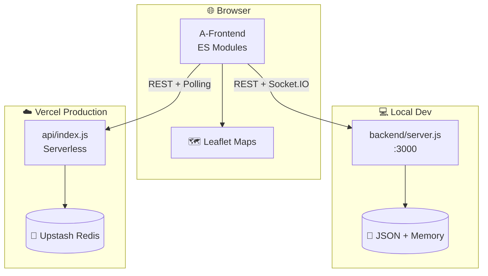

<div align="center">

# 🚌 RouteSync

### *Real-Time Transit Tracking Platform*

**Live maps · Role-based dashboards · Near real-time bus updates**

<br/>

[](https://route-sync-five.vercel.app)
[](LICENSE)
[](https://nodejs.org/)
[](https://expressjs.com/)
[](https://route-sync-five.vercel.app)

<br/>

[](https://leafletjs.com/)
[](https://jwt.io/)
[](https://socket.io/)
[](https://upstash.com/)

<br/>

**[🌐 Live Demo](https://route-sync-five.vercel.app)** · **[🐛 Report Bug](../../issues)** · **[💡 Request Feature](../../issues)** · **[📖 Contributing](CONTRIBUTING.md)**

<br/>

</div>

---

## 📋 Table of Contents

- [About](#-about)
- [Live Demo](#-live-demo)
- [Key Highlights](#-key-highlights)
- [Features](#-features)
- [Tech Stack](#-tech-stack)
- [Architecture](#-architecture)
- [Screenshots](#-screenshots)
- [Getting Started](#-getting-started)
- [Environment Variables](#-environment-variables)
- [Deploy to Vercel](#-deploy-to-vercel)
- [Project Structure](#-project-structure)
- [API Reference](#-api-reference)
- [Skills Demonstrated](#-skills-demonstrated)
- [Resume Snippet](#-resume-snippet)
- [Author](#-author)
- [License](#-license)

---

## 🎯 About

**RouteSync** is a production-style **full-stack bus tracking web application** designed for three user roles — **Passengers**, **Drivers**, and **Admins**. It delivers interactive **Leaflet maps**, a **JWT-secured REST API**, and **live bus location updates** in a single deployable platform.

Built as a portfolio-grade project showcasing real-world patterns: modular frontend architecture, dual-mode persistence, serverless deployment, and role-based access control — **no XAMPP required**.

| 👤 Role | 🛠️ Capabilities |
|--------|----------------|
| 🧑‍🤝‍🧑 **Passenger** | Browse routes, track active buses, view ETAs & reviews — **no login** |
| 🚍 **Driver** | Start/end trips, broadcast GPS, auto-track along saved routes |
| 🛡️ **Admin** | Draw routes on map, search / edit / delete routes, network stats |

---

## 🌐 Live Demo

<div align="center">

### 👉 [**route-sync-five.vercel.app**](https://route-sync-five.vercel.app)

</div>

### 🔑 Demo Credentials

| Panel | 📧 Email | 🔒 Password |
|-------|----------|------------|
| 🚍 Driver | `demo-driver@routesync.app` | `demo1234` |
| 🛡️ Admin | `demo-admin@routesync.app` | `demo1234` |

> 💡 **Passenger** access works instantly — no sign-in needed.

---

## ⭐ Key Highlights

| | |
|---|---|
| 🗺️ | **Interactive maps** with route polylines, live bus markers & auto fit-bounds |
| 🔐 | **JWT authentication** with bcrypt-hashed passwords & role-based panels |
| 📡 | **Real-time updates** via Socket.IO (local) or HTTP polling (Vercel) |
| 🏗️ | **Modular ES module frontend** — passenger, driver, admin, maps, API layers |
| ☁️ | **Serverless-ready** — Vercel static hosting + Express API function |
| 💾 | **Dual storage** — local JSON for dev, Upstash Redis for production |
| ⚡ | **One-command dev** — `npm start` serves UI + API on port `3000` |

---

## ✨ Features

<details open>
<summary><b>🧑‍🤝‍🧑 Passenger Panel</b></summary>

- 🗺️ Route cards with active bus count
- 📍 Live bus tracking on interactive map
- ⏱️ Real-time ETA countdown per bus
- 💬 Bus reviews (read & post)
- 🚫 No authentication required

</details>

<details open>
<summary><b>🚍 Driver Dashboard</b></summary>

- 🟢 Trip lifecycle: `Offline → Ready → Active → Completed`
- 📡 Manual GPS updates or auto-track along route
- 🗺️ Route highlight & position on map
- 📊 Occupancy, speed & ETA display

</details>

<details open>
<summary><b>🛡️ Admin Panel</b></summary>

- ✏️ Draw routes directly on the map (Leaflet.draw)
- 🔍 Search, preview, edit & delete routes
- 📈 Route & stop count statistics
- ✅ Coordinate validation on save

</details>

---

## 🛠️ Tech Stack

<table>
<tr>
<td align="center" width="96">
<br/>
<b>Frontend</b><br/>
<sub>HTML · CSS · ES Modules</sub>
</td>
<td align="center" width="96">
<br/>
<b>Backend</b><br/>
<sub>Node.js · Express</sub>
</td>
<td align="center" width="96">
<br/>
<b>Maps</b><br/>
<sub>Leaflet · OSM</sub>
</td>
<td align="center" width="96">
<br/>
<b>Deploy</b><br/>
<sub>Vercel Serverless</sub>
</td>
<td align="center" width="96">
<br/>
<b>Storage</b><br/>
<sub>JSON · Redis</sub>
</td>
</tr>
</table>

| Layer | Technologies |
|-------|-------------|
| 🎨 **UI** | HTML5, CSS3, Inter-inspired design system, Font Awesome |
| 🧩 **Frontend** | Vanilla ES Modules, Leaflet, Leaflet.draw |
| ⚙️ **Backend** | Node.js, Express, JWT, bcryptjs, uuid |
| 📡 **Realtime** | Socket.IO (local) · HTTP polling (Vercel) |
| 🗺️ **Maps** | OpenStreetMap tiles |
| 💾 **Persistence** | JSON files (dev) · Upstash Redis (prod) |
| ☁️ **Hosting** | Vercel CDN + Serverless Functions |

---

## 🏗️ Architecture



---

## 📸 Screenshots

> Add screenshots of the Home, Passenger, Driver, and Admin panels here.

| Home | Passenger Map |
|:----:|:-------------:|
| *Role selection & demo creds* | *Live route tracking* |

| Driver Dashboard | Admin Panel |
|:----------------:|:-----------:|
| *Trip controls & map* | *Route drawing & management* |

---

## 🚀 Getting Started

### 📌 Prerequisites

- ⚡ [Node.js](https://nodejs.org/) **18+**
- 📦 npm

### 💻 Run Locally

```bash
# 1️⃣ Clone the repository
git clone https://github.com/Omcodesk/RouteSync.git
cd RouteSync

# 2️⃣ Install dependencies
npm install

# 3️⃣ Start the server
npm start
```

🌍 Open **http://localhost:3000** — frontend & API on the same port.

### 🎮 Optional — Bus Emulator

```powershell
cd emulator
$env:API_URL="http://localhost:3000/api/driver/update"
$env:ROUTES_FILE="..\backend\routes.json"
npm start
```

---

## 🔧 Environment Variables

Copy `.env.example` → `.env` for local overrides.

| Variable | Description | Required |
|----------|-------------|:--------:|
| `JWT_SECRET` | Secret for signing JWT tokens | ✅ Prod |
| `ALLOW_PUBLIC_ROUTES` | `true` — public route access for passengers | ✅ Demo |
| `DEMO_AUTO_VERIFY` | `true` — auto-verify registrations | ✅ Demo |
| `UPSTASH_REDIS_REST_URL` | Upstash Redis REST URL | ☁️ Vercel |
| `UPSTASH_REDIS_REST_TOKEN` | Upstash Redis token | ☁️ Vercel |
| `CRON_SECRET` | Secures `/api/demo/tick` | Optional |

---

## ☁️ Deploy to Vercel

```text
1️⃣  Push to GitHub  →  Vercel auto-deploys on push
2️⃣  Add Upstash Redis from Vercel Marketplace (recommended)
3️⃣  Set environment variables (see table above)
4️⃣  Deploy  →  postinstall bundles Leaflet assets automatically
```

> ⚠️ On Vercel, Socket.IO is disabled — the app uses **HTTP polling** + periodic demo bus ticks. Same UI, same dashboards.

---

## 📁 Project Structure

```
RouteSync/
├── 🎨 A-Frontend/          # Static UI (HTML, CSS, ES modules)
│   ├── js/                 # passenger · driver · admin · maps · api
│   └── vendor/             # Bundled Leaflet (build output)
├── ⚙️ backend/
│   ├── createApp.js        # Shared Express API routes
│   ├── server.js           # Local dev server (:3000)
│   └── lib/store.js        # JSON / Redis persistence layer
├── ☁️ api/index.js         # Vercel serverless entry
├── 🎮 emulator/            # Bus position simulator
├── 📜 scripts/             # Build helpers
└── ⚡ vercel.json          # Vercel routing config
```

---

## 📡 API Reference

| Method | Endpoint | Description |
|:------:|----------|-------------|
| `GET` | `/api/health` | ❤️ Health check |
| `GET` | `/api/routes` | 🗺️ List all routes |
| `POST` | `/api/auth/login` | 🔐 Login (driver / admin) |
| `POST` | `/api/auth/register` | 📝 Register new user |
| `POST` | `/api/driver/update` | 📍 Update bus position |
| `GET` | `/api/buses` | 🚌 List active buses |
| `GET` | `/api/buses/:id/reviews` | 💬 Get bus reviews |
| `POST` | `/api/buses/:id/reviews` | ✍️ Post a review |
| `GET` | `/api/demo/tick` | 🎮 Advance demo buses |

---

## 🎓 Skills Demonstrated

```
✅ Full-Stack Development        ✅ REST API Design
✅ Real-Time Web Applications     ✅ JWT Authentication & RBAC
✅ Interactive Geospatial UI      ✅ Serverless Deployment
✅ Modular JavaScript Architecture ✅ Dual-Mode Data Persistence
✅ CI/CD via Vercel + GitHub      ✅ Responsive UI / UX Design
```

---

## 📝 Resume Snippet

> **RouteSync** — Full-stack real-time bus tracking platform with Leaflet maps, Express REST API, JWT role-based auth, and live location updates. Deployed on Vercel with serverless architecture.  
> 🔗 **Live Demo:** [route-sync-five.vercel.app](https://route-sync-five.vercel.app)

---

## 👨‍💻 Author

<div align="center">

**Om Chaddha** · [@Omcodesk](https://github.com/Omcodesk)

[](https://github.com/Omcodesk)
[](https://route-sync-five.vercel.app)

<br/>

⭐ **Star this repo** if you found it useful!

</div>

---

## 📄 License

This project is licensed under the **[MIT License](LICENSE)**.

## 🔒 Security

Report vulnerabilities via **[SECURITY.md](SECURITY.md)** — please do not open public issues for security reports.

## 🤝 Contributing

Contributions are welcome! See **[CONTRIBUTING.md](CONTRIBUTING.md)** for guidelines.

---

<div align="center">

**Made with ❤️ by [Omcodesk](https://github.com/Omcodesk)**

*RouteSync © 2026*

</div>
