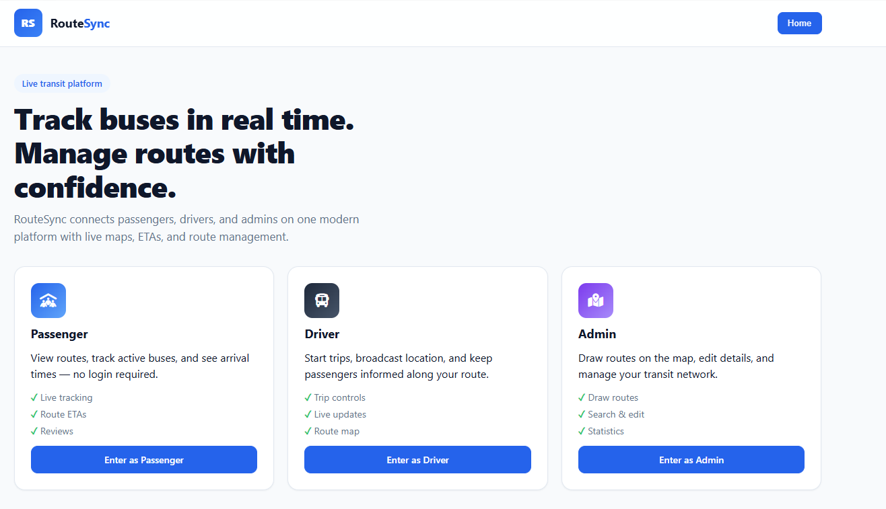
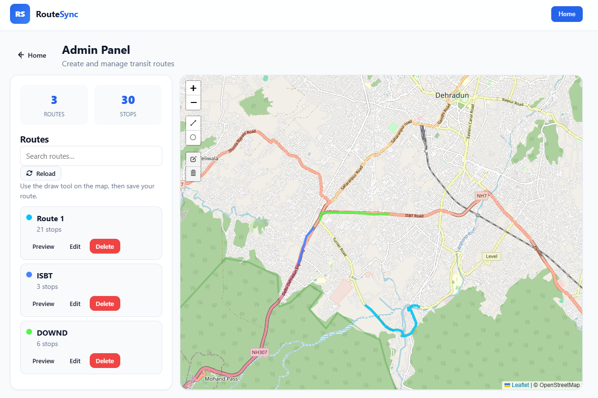
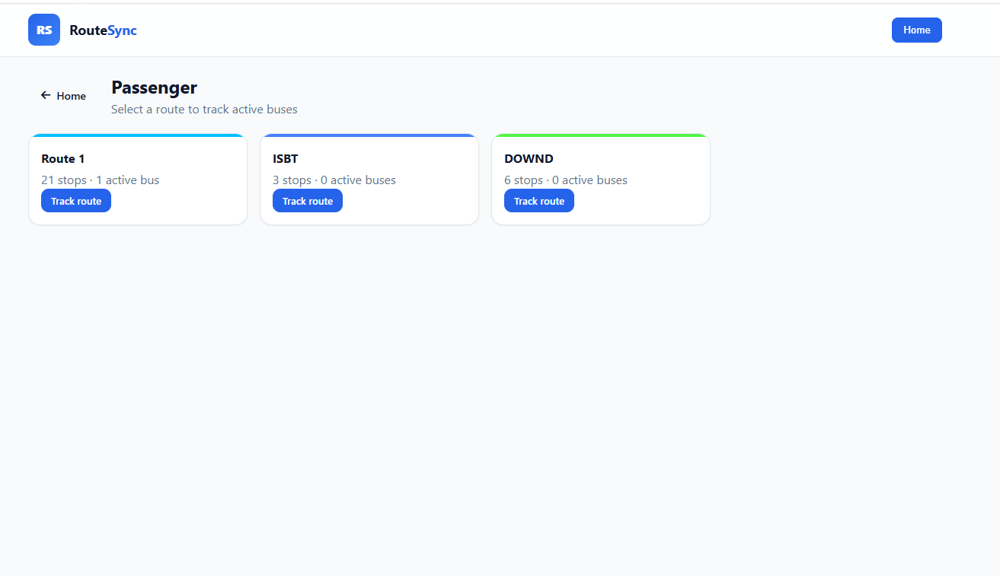
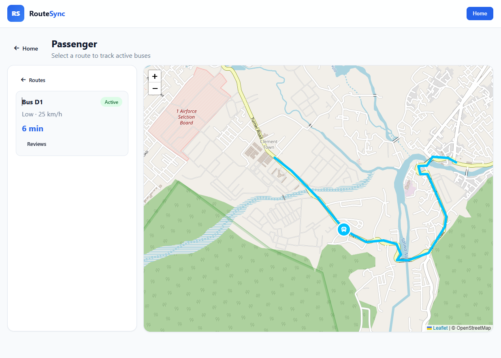
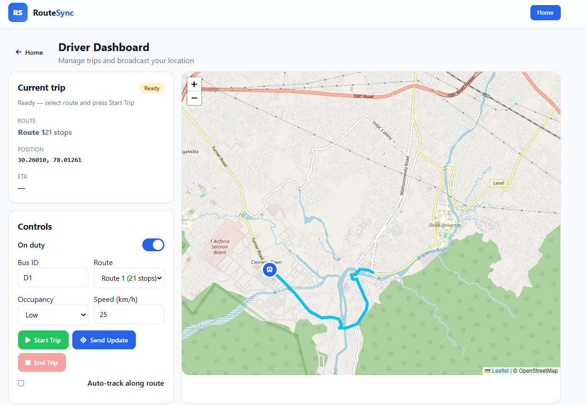
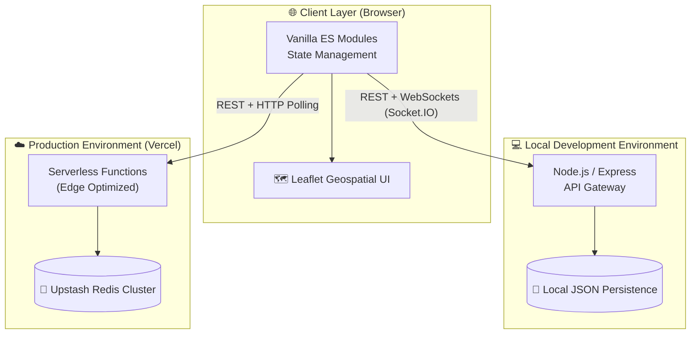

<div align="center">

# 🚌 RouteSync

### *Enterprise-Grade Real-Time Transit Tracking Platform*

**Live Geospatial Mapping · Role-Based Access Control · Serverless Architecture**

<br/>

[](https://route-sync-five.vercel.app)
[](https://developer.mozilla.org/en-US/docs/Web/JavaScript)
[](https://nodejs.org/)
[](https://expressjs.com/)
[](https://route-sync-five.vercel.app)

<br/>

[](https://leafletjs.com/)
[](https://jwt.io/)
[](https://socket.io/)
[](https://upstash.com/)

<br/>

**[🌐 Live Demo](https://route-sync-five.vercel.app)** · **[🐛 Report Bug](../../issues)** · **[💡 Request Feature](../../issues)** · **[📖 Contributing](CONTRIBUTING.md)**

<br/>

</div>

---

## 📋 Table of Contents

- [Overview](#-overview)
- [System Architecture](#-system-architecture)
- [Engineering Highlights](#-engineering-highlights)
- [Live Demo & Sandbox](#-live-demo--sandbox)
- [Role-Based Access Control (RBAC)](#-role-based-access-control-rbac)
- [Tech Stack](#-tech-stack)
- [Getting Started (Local Development)](#-getting-started-local-development)
- [Deployment (Vercel)](#-deployment-vercel)
- [API Reference](#-api-reference)
- [Author](#-author)

---

## 🎯 Overview

**RouteSync** is a production-style, full-stack transit tracking platform engineered to solve the challenges of real-time geospatial data synchronization. Designed to support three distinct user personas (Passengers, Drivers, and System Administrators), the application delivers interactive maps, a securely authenticated RESTful API, and near real-time GPS telemetry broadcasting.

Built as a comprehensive portfolio piece, RouteSync demonstrates mastery of modern web architecture patterns, including modular frontend design, dual-mode data persistence, serverless deployment, and strict role-based access control.

---

## 📸 Application Showcase

### Platform Landing Page
<div align="center">
  
  <p><i>Modern, responsive entry point with role-based routing</i></p>
</div>

### Admin Route Digitization
<div align="center">
  
  <p><i>Full CRUD operations and geospatial drawing using Leaflet.draw</i></p>
</div>

### Passenger Route Selection
<div align="center">
  
  <p><i>Browse active routes and view live fleet statistics</i></p>
</div>

### Passenger Live Tracking
<div align="center">
  
  <p><i>Real-time bus movement, intelligent ETAs, and occupancy monitoring</i></p>
</div>

### Live Driver Telemetry
<div align="center">
  
  <p><i>Live telemetry broadcasting and route assignment</i></p>
</div>

---

## 🏗️ System Architecture

RouteSync employs a robust, environment-aware architecture designed for both rapid local development and scalable edge deployment. 



### Key Architectural Decisions
- **Dual-Mode Persistence Layer:** The application dynamically detects its execution environment. In local development, it utilizes file-system JSON storage for zero-configuration startup. When deployed to Vercel, it seamlessly transitions to a highly available **Upstash Redis** cluster to support the ephemeral, read-only nature of serverless functions.
- **Protocol Fallbacks:** Real-time data streams via `Socket.IO` during local execution, but gracefully degrades to intelligent HTTP polling in serverless environments where persistent socket connections are unsupported.
- **Zero-Build Frontend:** The frontend eschews complex build steps in favor of native ES Modules, drastically reducing deployment times while maintaining strict modularity and separation of concerns.

---

## ⭐ Engineering Highlights

- 🗺️ **Geospatial Processing:** Interactive Leaflet maps with dynamic route polylines, auto-calculating bounding boxes, and real-time coordinate validation.
- 🔐 **Stateless Authentication:** Secure JWT-based authentication flow with `bcrypt` password hashing, ensuring secure token issuance without session overhead.
- ⏱️ **Algorithmic ETA Calculation:** Real-time predictive ETAs computed on the backend using the Haversine formula to calculate the distance between active bus coordinates and the remaining route polyline.
- 🛡️ **Defensive API Design:** Comprehensive backend validation to prevent malformed coordinate injection, unauthorized route mutations, and abuse.


---

## 🌐 Live Demo & Sandbox

I have deployed a live "Sandbox" environment tailored for recruiters and technical reviewers. 

<div align="center">

### 👉 [**route-sync-five.vercel.app**](https://route-sync-five.vercel.app)

</div>

### 🔑 Demo Credentials

| Role | Email | Password |
|-------|----------|------------|
| 🚍 **Driver** | `demo-driver@routesync.app` | `demo1234` |
| 🛡️ **Admin** | `demo-admin@routesync.app` | `demo1234` |

> 🔒 **Security Note:** To preserve the integrity of the live demo for all reviewers, the `demo-admin` account is locked into a **Read-Only Mode**. You may access all dashboards, but write operations (`POST`, `PUT`, `DELETE`) to the routing tables will gracefully return a `403 Forbidden`.

---

## 🛡️ Role-Based Access Control (RBAC)

The application strictly enforces permission boundaries across three distinct authorization tiers:

| Persona | Authentication | Capabilities |
|--------|----------------|----------------|
| 🧑‍🤝‍🧑 **Passenger** | Unauthenticated | Browse network, view live telemetry, access ETAs, read/write public reviews. |
| 🚍 **Driver** | JWT Required | Transmit GPS telemetry, manage trip lifecycle (`Offline → Ready → Active → Completed`). |
| 🛡️ **Admin** | JWT Required | Full CRUD authority over the routing network. Utilize `Leaflet.draw` to digitize new routes directly onto the map interface. |


---

## 🛠️ Tech Stack

| Layer | Technologies |
|-------|-------------|
| 🎨 **User Interface** | HTML5, CSS3, Custom Design System, Font Awesome |
| 🧩 **Frontend Logic** | JavaScript (ES6+), Vanilla ES Modules, Leaflet.js |
| ⚙️ **Backend API** | Node.js (JavaScript), Express.js, JWT, `bcryptjs` |
| 📡 **Real-Time Data** | Socket.IO (Local) / HTTP Polling (Serverless) |
| 💾 **Persistence** | File System (JSON) / Upstash Redis |
| ☁️ **Infrastructure** | Vercel CDN, Vercel Serverless Functions, Vercel Cron Jobs |

---

## 🚀 Getting Started (Local Development)

### Prerequisites
- [Node.js](https://nodejs.org/) (v18 or higher)
- npm

### Installation

```bash
# 1. Clone the repository
git clone https://github.com/Omcodesk/RouteSync.git
cd RouteSync

# 2. Install dependencies
npm install

# 3. Configure Environment Variables
cp .env.example backend/.env
# (Optional) Update backend/.env with your local configurations

# 4. Spin up the local server
npm start
```
The application will be available at **http://localhost:3000**.

---

## ☁️ Deployment (Vercel)

Deploying RouteSync to a production environment requires setting up the Upstash Redis integration.

1. Push your repository to GitHub and import it into **Vercel**.
2. Navigate to your Vercel project's **Storage** tab.
3. Connect a new **Upstash Redis** database. Vercel will automatically inject the required `KV_REST_API_URL` and `KV_REST_API_TOKEN` environment variables.
4. Set the following environment variables in Vercel:
   - `JWT_SECRET`: A secure, randomized cryptographic string.
   - `CRON_SECRET`: Required to secure the `/api/demo/tick` endpoint.
5. Trigger a **Redeploy**.

---

## 📡 API Reference

A brief overview of the RESTful endpoints powering RouteSync:

| Method | Endpoint | Auth Required | Purpose |
|:------:|----------|:-------------:|---------|
| `GET` | `/api/health` | - | Microservice health check & storage status |
| `GET` | `/api/routes` | - | Fetch active routing topologies |
| `POST` | `/api/auth/login` | - | Issue JWT for authenticated sessions |
| `POST` | `/api/routes` | **Admin** | Persist a newly digitized route |
| `POST` | `/api/driver/update`| **Driver** | Ingest live GPS telemetry payload |
| `GET` | `/api/buses` | - | Retrieve aggregated fleet coordinates |

---

## 👨‍💻 Author

<div align="center">

**Om Chaddha** · Software Engineer

[](https://github.com/Omcodesk)
[](https://route-sync-five.vercel.app)

</div>

---

## 📄 Licensing & Open Source

This project is open-source and available under the **[MIT License](LICENSE)**. 

- **Security:** Review our [Security Policy](SECURITY.md) before reporting vulnerabilities.
- **Contributing:** See [Contributing Guidelines](CONTRIBUTING.md) for architectural constraints and PR workflows.

<div align="center">
*Engineered by Omcodesk © 2026*
</div>
