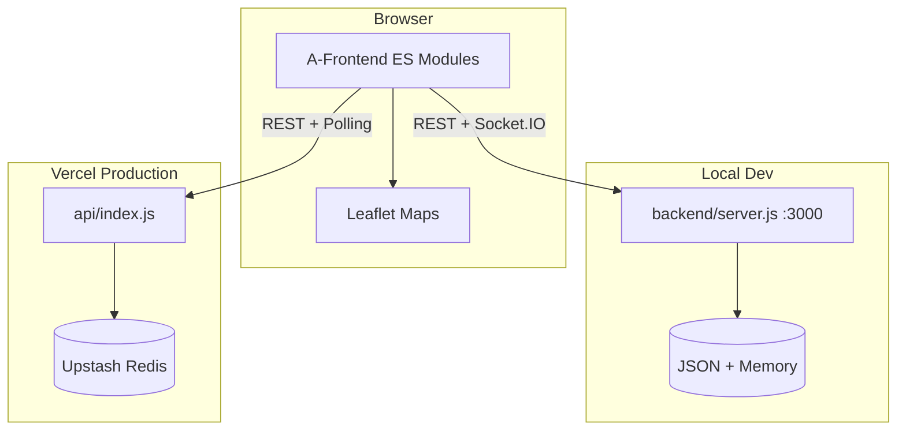

<div align="center">

# RouteSync

### Real-Time Transit Tracking Platform

**Live maps · Role-based dashboards · Near real-time bus updates**

[](https://route-sync-five.vercel.app)
[](LICENSE)
[](https://nodejs.org/)
[](https://expressjs.com/)

[Live Demo](https://route-sync-five.vercel.app) · [Report Bug](../../issues) · [Request Feature](../../issues)

</div>

---

## Overview

**RouteSync** is a full-stack bus tracking web application built for passengers, drivers, and transit admins. It combines interactive **Leaflet maps**, a **JWT-secured REST API**, and **live location updates** in a single deployable platform — no XAMPP or separate frontend server required.

| Role | Capabilities |
|------|----------------|
| **Passenger** | Browse routes, track active buses, view ETAs, read reviews — no login required |
| **Driver** | Start/end trips, broadcast GPS, auto-track along saved routes |
| **Admin** | Draw routes on map, search/edit/delete routes, view network stats |

---

## Live Demo

**https://route-sync-five.vercel.app**

### Demo credentials

| Panel | Email | Password |
|-------|-------|----------|
| Driver | `demo-driver@routesync.app` | `demo1234` |
| Admin | `demo-admin@routesync.app` | `demo1234` |

> Passenger access works without signing in.

---

## Features

- **Interactive maps** — Leaflet with route polylines, bus markers, and fit-to-route bounds
- **Three role dashboards** — Passenger, Driver, and Admin with dedicated UIs
- **Trip lifecycle** — Offline → Ready → Active → Completed workflow for drivers
- **ETA calculation** — Remaining distance along route with live countdown
- **Route management** — Draw, save, edit, delete, and preview routes (admin)
- **Reviews** — Passengers can read and post bus reviews
- **Dual runtime** — Socket.IO locally; HTTP polling on Vercel serverless
- **Dual storage** — JSON files locally; Upstash Redis in production (optional)
- **One-command local dev** — `npm start` serves frontend + API on port 3000

---

## Tech Stack

| Layer | Technologies |
|-------|----------------|
| **Frontend** | HTML5, CSS3, ES Modules, Leaflet, Leaflet.draw |
| **Backend** | Node.js, Express, JWT, bcrypt |
| **Realtime** | Socket.IO (local) · HTTP polling (Vercel) |
| **Maps** | OpenStreetMap tiles |
| **Storage** | JSON files · Upstash Redis |
| **Deploy** | Vercel (static + serverless API) |

---

## Architecture



---

## Quick Start

### Prerequisites

- [Node.js](https://nodejs.org/) 18+
- npm

### Run locally

```bash
git clone https://github.com/Omcodesk/RouteSync.git
cd RouteSync
npm install
npm start
```

Open **http://localhost:3000**

### Optional — bus emulator

```powershell
cd emulator
$env:API_URL="http://localhost:3000/api/driver/update"
$env:ROUTES_FILE="..\backend\routes.json"
npm start
```

---

## Environment Variables

Copy `.env.example` to `.env` for local overrides.

| Variable | Description | Required |
|----------|-------------|----------|
| `JWT_SECRET` | Secret for signing JWT tokens | Production |
| `ALLOW_PUBLIC_ROUTES` | `true` — passengers see routes without admin login | Demo |
| `DEMO_AUTO_VERIFY` | `true` — auto-verify new registrations | Demo |
| `UPSTASH_REDIS_REST_URL` | Upstash Redis URL | Vercel (recommended) |
| `UPSTASH_REDIS_REST_TOKEN` | Upstash Redis token | Vercel (recommended) |
| `CRON_SECRET` | Protects `/api/demo/tick` endpoint | Optional |

---

## Deploy to Vercel

1. Push this repo to GitHub and import it on [vercel.com](https://vercel.com).
2. Add **Upstash Redis** from the Vercel Marketplace (optional but recommended).
3. Set environment variables (see table above).
4. Deploy — `postinstall` bundles Leaflet assets automatically.

> On Vercel, Socket.IO is disabled; the app uses HTTP polling and periodic demo bus ticks — same UI, same dashboards.

---

## Project Structure

```
RouteSync/
├── A-Frontend/          # Static UI (HTML, CSS, ES modules)
│   └── js/              # passenger, driver, admin, maps, api, …
├── backend/
│   ├── createApp.js     # Shared Express routes
│   ├── server.js        # Local dev server
│   └── lib/store.js     # JSON / Redis persistence
├── api/index.js         # Vercel serverless entry
├── emulator/            # Optional bus position simulator
├── scripts/             # Build helpers (vendor copy)
└── vercel.json          # Vercel routing config
```

---

## API Overview

| Method | Endpoint | Description |
|--------|----------|-------------|
| `GET` | `/api/health` | Health check |
| `GET` | `/api/routes` | List all routes |
| `POST` | `/api/auth/login` | Login (driver/admin) |
| `POST` | `/api/driver/update` | Update bus position |
| `GET` | `/api/buses` | List active buses |
| `GET` | `/api/demo/tick` | Advance demo buses |

---

## Resume / Portfolio

> **RouteSync** — Real-time bus tracking platform with Leaflet maps, Express API, JWT role-based auth, and live updates.  
> **Live:** [route-sync-five.vercel.app](https://route-sync-five.vercel.app)

---

## Contributing

See [CONTRIBUTING.md](CONTRIBUTING.md).

## License

This project is licensed under the [MIT License](LICENSE).

## Security

To report a vulnerability, see [SECURITY.md](SECURITY.md).

---

<div align="center">

**Built by [Omcodesk](https://github.com/Omcodesk)**

</div>
